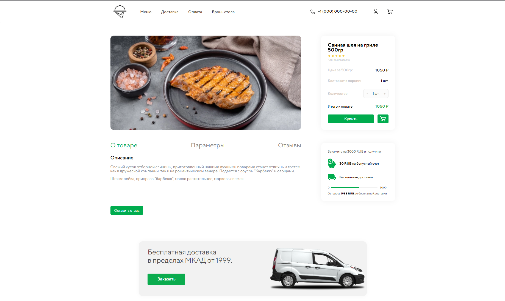

## Курсовая работа по направлению "Разработка клиентских частей интернет-ресурсов" на тему "сервис по доставке еды из ресторана"

В 2020 году, в связи со вспышкой вируса COVID-19, как никогда прежде стала актуальна тема доставки еды из ресторанов или
общепитов. Ориентируясь на официальную статистику, отмечу, что в 2020 году агрегаторы усилили свои позиции на рынке
доставки. Delivery Club и «Яндекс. Еда» впервые заняли свыше четверти рынка доставки — *27,7%* в 2020 году против
*18,6%* в 2019 году, а согласно прогнозам РБК, в 2020 году рынок доставки готовой еды ожидает рекордный рост на *47%*.

В данной курсовой работе я рассматриваю значимость способа доставки еды из ресторанов, анализируя существующие
веб-сервисы и отдельные веб-страницы ресторанов Москвы. Я так же ставлю задачу разработать простой и удобный
пользовательский интерфейс с современным дизайном.

### Главная страница, на которой располагается каталог и самые свежие предложения


### Для каждого блюда своя страница



### Модальные окна для регистрации и входа написаны на Java Script

```javascript
const CLASS_LIST_LOGIN = {
    MODAL_LOGIN: 'login-modal',
    MODAL_ACTIVE_LOGIN: 'login-modal-active',
    TRIGGER_OPEN_LOGIN: 'js-modal-open',
    TRIGGER_CLOSE_LOGIN: 'js-modal-close'
};

document.addEventListener('click', (event) => {
//open
    if (event.target.closest(`.${CLASS_LIST_LOGIN.TRIGGER_OPEN_LOGIN}`)) {
        console.log('open');
        event.preventDefault();
        const target = event.target.closest(.$
        {
            CLASS_LIST_LOGIN.TRIGGER_OPEN_LOGIN
        }
    )
        ;
        const modalId = target.getAttribute('href').replace('#', '');
        const modal = document.getElementById(modalId);
        document.body.style.overflow = 'hidden';
        modal.classList.add(CLASS_LIST_LOGIN.MODAL_ACTIVE_LOGIN);
    }
    //close
    if (event.target.closest(`.${CLASS_LIST_LOGIN.TRIGGER_CLOSE_LOGIN}`) ||
        event.target.classList.contains(CLASS_LIST_LOGIN.MODAL_ACTIVE_LOGIN)
    ) {
        console.log('close');
        event.preventDefault();
        const modal = event.target.closest(`.${CLASS_LIST_LOGIN.MODAL_LOGIN}`);
        document.body.style.overflow = 'visible';
        modal.classList.remove(CLASS_LIST_LOGIN.MODAL_ACTIVE_LOGIN);
    }
});
```


### Сайт адаптирован под современные устройства


